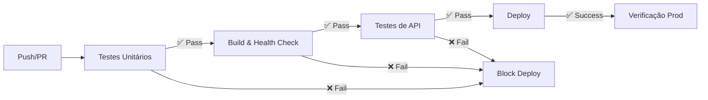

# 🧪 Estratégia de Testes - Document Classifier

Documentação completa da estratégia de testes para o Document Classifier.

## 📋 Índice

- [Visão Geral](#visão-geral)
- [Tipos de Testes](#tipos-de-testes)
- [Estrutura de Testes](#estrutura-de-testes)
- [Como Rodar](#como-rodar)
- [CI/CD Pipeline](#cicd-pipeline)
- [Métricas e Coverage](#métricas-e-coverage)
- [Boas Práticas](#boas-práticas)

---

## 📊 Visão Geral

O projeto implementa uma suite completa de testes em **3 níveis**:

1. **Testes Unitários** (pytest) - Happy + Negative paths
2. **Testes de Integração API** (Postman + Newman) - Happy + Negative paths  
3. **Testes de CI/CD** (GitHub Actions) - Automação completa

### **Filosofia de Testes:**

✅ **Test Early, Test Often**  
- Testes rodam ANTES de cada commit (pre-commit hooks)  
- Testes rodam AUTOMATICAMENTE em cada push (CI/CD)  
- Deploy BLOQUEADO se testes falharem  

✅ **Happy Path + Negative Path**  
- Cada funcionalidade tem teste de sucesso (happy path)  
- Cada funcionalidade tem teste de erro (negative path)  

✅ **Coverage > 70%**  
- Meta: 70%+ de code coverage  
- Relatórios automáticos em cada execução  

---

## 🧪 Tipos de Testes

### **1️⃣ Testes Unitários (Pytest)**

**Localização:** `tests/`  
**Framework:** pytest + pytest-cov  
**Executar:** `./run_tests.sh unit`  

#### **Módulos Testados:**

| Módulo | Arquivo | Happy Paths | Negative Paths | Coverage Meta |
|--------|---------|-------------|----------------|---------------|
| `ClassificadorFinal` | `test_classificador.py` | 4 | 6 | 80% |
| `API Flask` | `test_api.py` | 13 | 7 | 70% |
| `TextAnalyzer` | `test_text_analyzer.py` | 5 | 3 | 60% |
| `ParagraphDetector` | `test_paragraph_detector.py` | 4 | 3 | 60% |

#### **Exemplos de Testes:**

**Happy Path:**
```python
def test_classify_advertisement_happy_path(mock_image):
    """
    Input: Imagem de advertisement
    Expected: classification='advertisement', success=True
    """
    result = clf.classify(mock_image)
    assert result['success'] is True
    assert result['classification'] == 'advertisement'
```

**Negative Path:**
```python
def test_classify_nonexistent_file_negative():
    """
    Input: Arquivo inexistente
    Expected: Exceção levantada
    """
    with pytest.raises(Exception):
        clf.classify('/fake/path.tif')
```

### **2️⃣ Testes de API (Postman + Newman)**

**Localização:** `postman/`  
**Framework:** Postman Collection + Newman CLI  
**Executar:** `./run_tests.sh api`  

#### **Endpoints Testados:**

| Endpoint | Happy Paths | Negative Paths | Total |
|----------|-------------|----------------|-------|
| Health Checks | 3 | 1 | 4 |
| Classification | 2 | 4 | 6 |
| Async | 2 | 0 | 2 |
| Feedback | 3 | 2 | 5 |
| **TOTAL** | **10** | **7** | **17** |

#### **Exemplo de Teste:**

```javascript
pm.test("Classification returns valid result", function () {
    var jsonData = pm.response.json();
    pm.expect(jsonData).to.have.property('classification');
    pm.expect(jsonData.classification).to.be.oneOf(['advertisement', 'scientific_article']);
    pm.expect(jsonData.success).to.eql(true);
});
```

### **3️⃣ Testes de CI/CD (GitHub Actions)**

**Localização:** `.github/workflows/ci.yml`  
**Trigger:** Push para `main`, PRs  
**Executar:** Automático no GitHub  

#### **Pipeline:**



---

## 📁 Estrutura de Testes

```
document_classifier_project/
├── tests/                              # Testes unitários
│   ├── __init__.py
│   ├── test_classificador.py           # Testes do ClassificadorFinal
│   ├── test_api.py                     # Testes da API Flask
│   ├── test_text_analyzer.py           # Testes do TextAnalyzer
│   ├── test_paragraph_detector.py      # Testes do ParagraphDetector
│   └── README.md
│
├── postman/                            # Testes de API
│   ├── document-classifier-api.postman_collection.json
│   ├── document-classifier.postman_environment.json
│   ├── document-classifier-production.postman_environment.json
│   └── README.md
│
├── test_images/                        # Imagens para testes
│   ├── advertisement.tif               # (adicionar manualmente)
│   ├── scientific.tif                  # (adicionar manualmente)
│   ├── invalid.jpg                     # (adicionar manualmente)
│   └── README.md
│
├── .github/workflows/                  # CI/CD
│   └── ci.yml                          # GitHub Actions workflow
│
├── pytest.ini                          # Configuração do pytest
├── .pre-commit-config.yaml             # Pre-commit hooks
├── requirements-dev.txt                # Dependências de teste
├── run_tests.sh                        # Script para rodar testes
└── TESTING.md                          # Este arquivo
```

---

## 🚀 Como Rodar

### **Instalação:**

```bash
# Dependências principais
pip install -r requirements.txt

# Dependências de teste
pip install -r requirements-dev.txt

# Newman (para testes de API)
npm install -g newman newman-reporter-htmlextra

# Pre-commit hooks (opcional)
pip install pre-commit
pre-commit install
```

### **Rodar Testes:**

#### **Opção 1: Script Facilitado**

```bash
# Todos os testes
./run_tests.sh all

# Apenas testes unitários
./run_tests.sh unit

# Apenas testes de API
./run_tests.sh api

# Apenas happy paths
./run_tests.sh happy

# Apenas negative paths
./run_tests.sh negative

# Gerar relatório de coverage
./run_tests.sh coverage

# Testes rápidos
./run_tests.sh quick

# Limpar arquivos de teste
./run_tests.sh clean
```

#### **Opção 2: Comandos Diretos**

**Pytest:**
```bash
# Todos os testes
pytest tests/ -v

# Com coverage
pytest tests/ --cov=. --cov-report=html

# Apenas um arquivo
pytest tests/test_api.py -v

# Apenas um teste
pytest tests/test_api.py::TestHealthEndpoints::test_health_endpoint_happy_path -v
```

**Newman:**
```bash
# Local
newman run postman/document-classifier-api.postman_collection.json \
  -e postman/document-classifier.postman_environment.json \
  --reporters cli,htmlextra \
  --reporter-htmlextra-export newman/report.html

# Produção
newman run postman/document-classifier-api.postman_collection.json \
  -e postman/document-classifier-production.postman_environment.json
```

---

## 🔄 CI/CD Pipeline

### **Fluxo Completo:**

1. **Developer faz commit localmente**
   - Pre-commit hook roda testes unitários
   - Se falhar → Commit bloqueado
   - Se passar → Commit permitido

2. **Developer faz push para GitHub**
   - GitHub Actions disparado automaticamente
   - **Job 1:** Testes Unitários (pytest)
     - Roda todos os testes em `tests/`
     - Gera coverage report
     - Falha → Pipeline PARA aqui
   
3. **Se Job 1 passar:**
   - **Job 2:** Build & Health Check
     - Verifica imports
     - Inicia API
     - Testa endpoints críticos
     - Falha → Pipeline PARA aqui
   
4. **Se Job 2 passar:**
   - **Job 3:** Testes de API (Newman)
     - Roda collection completa
     - 17 testes de integração
     - Gera relatório HTML
     - Falha → Pipeline PARA aqui
   
5. **Se Job 3 passar (apenas em push para `main`):**
   - **Job 4:** Deploy para Render
     - Dispara webhook de deploy
     - Aguarda deploy completar
     - Verifica health check em produção
   
6. **Se Job 4 passar:**
   - **Job 5:** Notificação de sucesso
     - Log de sucesso
     - URLs da aplicação

### **Tempo Estimado:**

- Testes Unitários: ~30s
- Build & Health Check: ~45s
- Testes de API: ~1-2min
- Deploy: ~2-3min
- **Total: ~5-6 minutos**

### **Segredos Necessários no GitHub:**

```bash
# .github/secrets
RENDER_DEPLOY_HOOK=https://api.render.com/deploy/...
```

---

## 📊 Métricas e Coverage

### **Relatórios Gerados:**

| Ferramenta | Relatório | Localização |
|------------|-----------|-------------|
| Pytest | HTML Coverage | `htmlcov/index.html` |
| Pytest | XML Coverage | `coverage.xml` |
| Pytest | JUnit XML | `junit/test-results.xml` |
| Newman | HTML Report | `newman/report.html` |
| Newman | JUnit XML | `newman/junit-report.xml` |

### **Visualizar Relatórios:**

```bash
# Coverage local
./run_tests.sh coverage
# Abre automaticamente: htmlcov/index.html

# Newman local
./run_tests.sh api
# Abre automaticamente: newman/report.html

# GitHub Actions
# Ver: Actions tab → Workflow run → Artifacts
```

### **Metas de Coverage:**

| Módulo | Meta | Atual |
|--------|------|-------|
| `api.py` | 70% | - |
| `classificador_final.py` | 80% | - |
| `text_analyzer*.py` | 60% | - |
| `paragraph_detector.py` | 60% | - |
| **Projeto Total** | **70%** | - |

---

## ✅ Boas Práticas

### **1. Nomenclatura de Testes:**

```python
def test_<funcao>_<cenario>_<tipo>():
    """
    HAPPY/NEGATIVE PATH: Descrição clara
    
    Input: O que entra
    Expected: O que deve sair
    """
    # Arrange (preparar)
    # Act (executar)
    # Assert (verificar)
```

### **2. Estrutura AAA (Arrange-Act-Assert):**

```python
def test_classify_advertisement():
    # Arrange: Preparar dados
    image_path = create_mock_advertisement()
    
    # Act: Executar função
    result = classifier.classify(image_path)
    
    # Assert: Verificar resultado
    assert result['classification'] == 'advertisement'
```

### **3. Fixtures para Reutilização:**

```python
@pytest.fixture
def mock_image():
    """Criar imagem de teste (reutilizável)"""
    img = Image.new('RGB', (800, 600), color='white')
    # ... configurar imagem
    yield img
    # ... cleanup se necessário
```

### **4. Testar Edge Cases:**

```python
# Happy Path
def test_with_valid_input():
    pass

# Negative Paths
def test_with_empty_input():
    pass

def test_with_invalid_format():
    pass

def test_with_corrupted_data():
    pass

def test_with_extreme_values():
    pass
```

### **5. Mocks para Dependências Externas:**

```python
from unittest.mock import Mock, patch

@patch('api.ClassificadorFinal')
def test_api_endpoint(mock_classifier):
    mock_classifier.return_value.classify.return_value = {'success': True}
    # Testar endpoint sem depender do classificador real
```

### **6. Timeouts para Testes Lentos:**

```python
@pytest.mark.timeout(30)
def test_slow_ocr_process():
    # Falha se demorar > 30s
    result = process_ocr(large_image)
```

### **7. Skip Condicional:**

```python
@pytest.mark.skipif(not has_tesseract(), reason="Tesseract não instalado")
def test_ocr_extraction():
    pass
```

---

## 🐛 Debugging e Troubleshooting

### **Testes Unitários Falhando:**

```bash
# Modo verboso
pytest tests/ -vv -s

# Debugger
pytest tests/test_api.py --pdb

# Apenas testes que falharam
pytest tests/ --lf
```

### **Newman Falhando:**

```bash
# Verificar se API está rodando
curl http://localhost:5000/health

# Aumentar timeout
newman run ... --timeout-request 120000

# Ver logs detalhados
newman run ... --verbose
```

### **GitHub Actions Falhando:**

1. Ver logs: `Actions tab → Workflow run → Job que falhou`
2. Reproduzir localmente: `./run_tests.sh all`
3. Verificar dependências: `pip list`
4. Verificar Python version: `python --version`

---

## 📚 Recursos Adicionais

- **Pytest Docs:** https://docs.pytest.org/
- **Newman Docs:** https://learning.postman.com/docs/running-collections/using-newman-cli/command-line-integration-with-newman/
- **GitHub Actions:** https://docs.github.com/en/actions
- **Pre-commit:** https://pre-commit.com/

---

## 🎯 Checklist de Testes

Antes de fazer commit:

- [ ] Rodar testes unitários: `./run_tests.sh unit`
- [ ] Coverage > 70%: `./run_tests.sh coverage`
- [ ] Testes de API passam (se API rodando): `./run_tests.sh api`
- [ ] Código formatado: `black .`
- [ ] Imports ordenados: `isort .`
- [ ] Lint pass: `flake8 .`

Antes de fazer deploy:

- [ ] Todos os testes passam: `./run_tests.sh all`
- [ ] Pre-commit hooks configurados: `pre-commit install`
- [ ] GitHub Actions verde ✅
- [ ] Imagens de teste adicionadas (se necessário)
- [ ] README atualizado

---

**✅ Com essa suite de testes, garantimos qualidade, confiabilidade e entrega contínua!** 🚀

